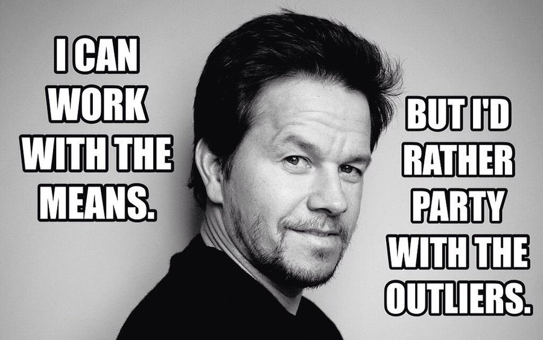

# Pesquisa Aplicada

## Sumário

* [Conteúdos](capitulos/README.md)
* [Dados da disciplina](#dados-da-disciplina)
* [Plano de ensino](#plano-de-ensino)
* [Avaliação](#avaliação)
* [Perguntas & Respostas](#perguntas--respostas)
* [Programa da disciplina e bibliografia](#programa-da-disciplina-e-bibliografia)
* [Contato](#contato)

## Dados da disciplina

| Dado          | Valor                                                       |
|:--------------|:------------------------------------------------------------|
| Nome          | Pesquisa aplicada                                           |
| Código        | DPADI0174                                                   |
| Curso         | Tecnologia em Redes de Computadores                         |
| Carga horária | 15h prática, 30h teórica (45h total)                        |
| Ementário     | [link](https://www.ufsm.br/ementario/disciplinas/DPADI0174) |

## Plano de ensino

Será disponibilizado no Moodle da disciplina.

## Avaliação

Serão 3 os instrumentos avaliativos:

1. **(33%)** Uma prova de leitura e análise de artigos científicos;
2. **(33%)** Uma prova de escrita de texto científico;
3. **(34%)** Uma redação de artigo, no formato MDT, revisado por pares.

## Perguntas & Respostas

**❓ Por que eu preciso fazer essa disciplina? 😫**

Para ter uma melhor compreensão de pesquisa acadêmica, elaboração de documentos acadêmicos, e suas 
tecnologias.

(e também porque, se você for fazer TCC, você vai precisar saber 100% do que esta disciplina cobre)

**❓ O professor cobra presença? ☝️🤓**

Sim! É preciso no mínimo 75% de presença para ser aprovado na disciplina.

**❓ Dá pra reprovar por presença então?? 😫**

Sim! 😬

**❓ Posso copiar meu trabalho da Internet/de um colega/do ChatGPT? ☝️🤓**  

Não! 

> [!CAUTION]
> Segundo o [Código de Ética e Convivência Discente da Universidade Federal de Santa Maria de 2018](https://www.ufsm.br/pro-reitorias/proplan/codigo-de-etica-e-convivencia-discente-da-universidade-federal-de-santa-maria), 
> Artigo 11º, Inciso VIII, é uma **infração grave** "plagiar, total ou parcialmente, obras literárias, 
> artísticas, científicas, técnicas ou culturais".

**❓ Tá, mas o que acontece se eu...** 

* ...gerar todo o meu trabalho pelo ChatGPT? ☝️🤓
  * nota zero! ⭕
* ...copiar da Internet? ☝️🤓
  * nota zero! ⭕
* ...copiar do meu colega? ☝️🤓
  * 50% da nota para os dois alunos 
  * se alguém abrir o bico e dedurar o coleguinha, 100% da nota para quem abrir o bico, 0% para quem ficou quieto
* ...pagar um veterano para fazer o meu trabalho? ☝️🤓
  * [você tem brio?](https://www.youtube.com/watch?v=TRPBY_lxJfE)

> [!CAUTION]
> Segundo o [Código de Ética e Convivência Discente da Universidade Federal de Santa Maria de 2018](https://www.ufsm.br/pro-reitorias/proplan/codigo-de-etica-e-convivencia-discente-da-universidade-federal-de-santa-maria), 
> Artigo 9, Inciso V, é uma **infração média** "incumbir outra pessoa do desempenho de tarefa que seja de sua 
> responsabilidade".

> [!CAUTION]
> Segundo o [Código de Ética e Convivência Discente da Universidade Federal de Santa Maria de 2018](https://www.ufsm.br/pro-reitorias/proplan/codigo-de-etica-e-convivencia-discente-da-universidade-federal-de-santa-maria), 
> Artigo 11, Inciso XIV, é uma **infração grave** "recorrer a meios fraudulentos para lograr aprovação, promoção ou 
> outra vantagem, para si ou para outrem".

**❓ O que acontece se eu entregar meu trabalho atrasado?**  

Eu não aceito submissão de trabalhos atrasados! Envie uma versão provisória no Moodle, ou na pior das 
hipóteses (caso o Moodle esteja fora do ar), para o meu e-mail.

**❓ Tenho uma dúvida fora do horário de aula. O que eu faço com ela?**  

Me mande um e-mail! [henry.cagnini@ufsm.br]()

## Programa da disciplina e bibliografia

Confira o programa da disciplina no seguinte link: https://www.ufsm.br/ementario/disciplinas/DPADI0174

## Contato

Preferencialmente, por e-mail: [henry.cagnini@ufsm.br]()

(não vou responder caso envie uma mensagem no WhatsApp!)
