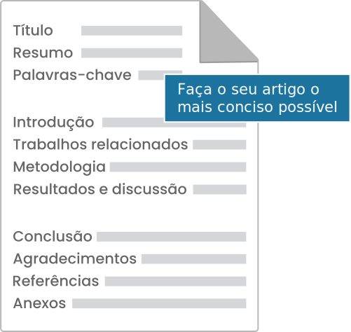

[](https://liascript.github.io/course/?https://raw.githubusercontent.com/CTISM-Prof-Henry/research/main/capitulos/ARTIGOS.md)

# Estrutura de um artigo

A estrutura básica de um artigo pode ser descrita da seguinte forma: 



## Título

O título deve comunicar, de maneira mais breve possível, a ideia geral do artigo. Geralmente é limitado a no máximo
3 linhas.

**Bônus:** escreva um título que seja chamativo a partir de um motor de busca. Por exemplo, `Uma rede neural para 
agendamento de salas de aula` é um título mais eficiente do que `Multilayer perceptron para resolução do problema de 
agendamento`.

## Resumo

O resumo é uma versão expandida do título. Contém geralmente entre 150 e 250 palavras, e comunica toda a ideia do 
artigo: o problema a ser resolvido, a solução proposta, os resultados obtidos, e uma brevíssima discussão. 

Não devemos incluir citações - por exemplo, (CAGNINI, 2018) - nem siglas (CTISM) no resumo.  

## Palavras-chave

Geralmente limitadas de 3 a 5, são as chaves que serão inseridas em motores de busca (Scopus, IEEE Xplore, Science 
Direct, etc) para indexar o artigo. As palavras-chave podem ser mais específicas do que o título.

Por exemplo, para um trabalho intitulado `Uma rede neural para agendamento de salas de aula`, as palavras-chave poderiam 
ser: rede neural, multilayer perceptron, problema do agendamento.

## Introdução

A introdução é uma versão expandida do resumo e uma versão reduzida do artigo. Não existe limite de palavras para esta 
seção. É possível introduzir siglas e fazer citações. Porém, deve-se evitar referenciar figuras, tabelas, fórmulas, etc 
nesta seção.

Uma boa estrutura de introdução é a seguinte: 

1. O primeiro parágrafo introduz de maneira geral o problema ("na era da tecnologia atual...");
2. O segundo parágrafo discute de maneira específica o problema ("existe um problema com a tecnologia atual que é...");
3. Terceiro parágrafo introduz rapidamente a literatura revisada, e uma análise breve do que foi descoberto;
4. O terceiro parágrafo ou quarto (a depender da escrita) pode propor uma nova solução para o problema, e discorrer 
   brevemente o que o artigo descobre/propõe;
5. O último parágrafo da introdução é reservado para um índice do resto do artigo:
   > O resto deste artigo é organizado da seguinte forma. A Seção 2 traz os trabalhos relacionados. A Seção 3 introduz a
   > metodologia adotada para resolver o problema. [...]

## Trabalhos relacionados

Nesta seção, descreve-se o levantamento da literatura feito anteriormente ao início do trabalho. Caso o artigo esteja
propondo um novo método que será comparado ao que existia anteriormente, é possível introduzir brevemente os 
competidores, deixando para fazer uma descrição detalhada na seção de [Metodologia](#metodologia). 

O objetivo desta seção é mostrar que os autores fizeram um trabalho de busca antes de escrever um novo artigo, 
identificando os pontos fortes e fracos do que já está disponível na literatura. 

Cada parágrafo da revisão da literatura pode ser um artigo revisado, caso cada artigo revisado seja **muito relevante**, 
ou então um tópico abordado, e listar os artigos que trabalham aquele tópico. Se o artigo fosse de segurança do trabalho, 
poderia-se ter um parágrafo para cada tópico (Equipamentos de Proteção Individual, Equipamentos de Proteção Coletiva), 
e explicar o que cada artigo que fala sobre aqueles tópicos está discutindo.

## Metodologia

Na metodologia descreve-se como o problema (introduzido brevemente no resumo, e de maneira mais demorada na introdução) 
será resolvido neste artigo. É o momento de entrar em grandes detalhes, descrever algoritmos, introduzir conceitos 
amplamente, elencar as tecnologias usadas (a configuração do computador usado para rodar experimentos, por exemplo),
dentre outros aspectos técnicos.

Pode-se também descrever em maiores detalhes sobre um método já existente na literatura, que será comparado com o método
proposto neste artigo.

Também descreve-se a configuração dos experimentos, se houverem, e como estes experimentos podem ser reproduzidos pelo 
leitor.

No caso de uma revisão da literatura, descreve-se como foi feita a busca dos artigos na Web (fontes de dados, strings de 
busca, número de artigos retornados, número de artigos que tiveram o resumo lido, número de artigos que foram 
completamente revisados).

## Resultados e discussão

Nesta seção, descreve-se os resultados obtidos, e discute-se as causas que levaram aos resultados, e o
que eles significam.

É sempre importante enquadrar o método proposto no artigo sob uma luz positiva, enfatizando seus pontos fortes em 
relação ao que já existia na literatura.

No caso de uma revisão da literatura, é a hora de **discutir** o que os artigos estão "falando". Isto quer dizer, 
fazer uma leitura crítica dos autores e tentar traçar um consenso entre a opinião deles. Caso não haja consenso, 
é a hora de deixar claro que o tópico ainda está sendo discutido na literatura. 

## Conclusão

A conclusão é a introdução no fim do artigo. Porém, diferente da introdução, deve-se evitar **introduzir** novos 
conceitos, como siglas, e fazer citações; tudo o que precisava ser dito, já deveria ter sido dito anteriormente. Reserve
a conclusão para discorrer brevemente sobre o problema a ser resolvido, como ele foi resolvido neste artigo, os 
resultados obtidos, a qualidade dos resultados, e quais as direções futuras para um próximo artigo, nesta mesma linha de
pesquisa.

## Agradecimentos

> [!NOTE]
> Esta seção é opcional.

Geralmente são agradecidos os órgãos de fomento que financiaram esta pesquisa (CAPES, CNPq, etc), e pessoas que 
colaboraram na elaboração do artigo, mas não tiveram um envolvimento grande o suficiente para serem creditadas como 
autores (por exemplo, alguém que revisou a ortografia voluntariamente).

## Referências

As referências são onde colocamos a lista de todos os artigos, revistas, sites, softwares, etc que referenciamos no 
texto. Geralmente, existe um conjunto de regras sobre como os artigos devem ser elencados na lista de referências

* Por ordem alfabética, ou por ordem de citação;
* Artigos com mais de 4 autores devem ser citados como `Fulano et al.`;
* No formato `(CAGNINI, 2018)`, ou então `[1]`;
* Regras específicas de como citar páginas de livros, artigos em proceedings, etc.

O [LaTeX](LATEX.md) cuida automaticamente de todas estas regras.  

> [!IMPORTANT]
> Cite as referências no texto! O LaTeX faz isto automaticamente: Ao usar `\cite{cagnini2018eda}` no corpo do texto por
> exemplo, é adicionada automaticamente uma entrada na lista de referências no documento LaTeX. Porém, se você utilizar 
> o Word, você precisará citar todos os artigos no corpo do texto para só então adicioná-los à lista de referências. 

> [!IMPORTANT]
> Veja se as entradas BibTeX (que podem ser coletadas no botão "Citar" ao pesquisar um artigo no Google Scholar) usadas
> possuem todos os campos necessários. Por exemplo, caso esteja citando um livro `@book`, veja
> se o campo `numpages` está preenchido. Se não estiver, será necessário coletar esta informação na Internet!
> Exemplo: isto é um livro, mas a referência do Google Scholar traz como um item misto:
> ```latex
> @misc{goodfellow2016deep,
>  title={Deep learning},
>  author={Goodfellow, Ian},
>  year={2016},
>  publisher={MIT press}
> }
> ```
> Será necessário então procurar como é feita a entrada `@book` e preencher os campos faltantes.

## Anexos

> [!NOTE]
> Esta seção é opcional.

Nos anexos colocamos todos os itens que não couberam no artigo, seja por limitação de páginas, ou limitação finalidade:
por exemplo, tabelas com resultados intermediários de experimentos.

Hoje em dia é mais incomum anexar estes metadados, sendo mais prático colocar um link no artigo como uma nota de rodapé
indicando onde na internet aquele anexo está disponível:

> Disponibilizamos o código-fonte[^1] do nosso algoritmo, bem como o dataset[^2] usado.
> 
> [^1]: Disponível em https://github.com/CTISM-Prof-Henry/research. 
> [^2]: Disponível em https://zenodo.org/records/7139621.

## Dicas de escrita

**✍️ Escreve isso aí direito!** Hoje em dia existem corretores ortográficos em diversos editores de texto, e até mesmo 
no próprio teclado virtual de dispositivos móveis. Não existe razão para não revisar a ortografia do texto! 

**📏 Seja conciso:** comunique suas ideias da maneira mais breve possível, sempre. Um leitor atento consegue sempre ver 
se o autor domina o assunto ou não! Além do mais, se a introdução de um artigo for fraca, mas o método for forte, um 
leitor pode desconsiderar o artigo como um todo simplesmente porque não há consistência entre as seções.

**😇 Seja honesto:** Usou ChatGPT para escrever o texto? Deixe isto claro! Algumas revistas **exigem** que os autores 
digam se usaram IAs para auxiliar na escrita do texto. Leitores atentos, novamente, conseguem dizer se um texto foi 
gerado por uma IA; não deixar isto claro pode lhe prejudicar durante o processo de avaliação!

**🚾 Introduza as siglas antes de usá-las:** Ao escrever `O Colégio Técnico Industrial de Santa Maria (CTISM)`,
isso nos possibilita referenciá-lo apenas por `CTISM` no futuro.

**📎 Cuidado onde vai disponibilizar anexos:** prefira plataformas que geram _permalinks_ para recursos, e não exigem 
autorização para visualizar arquivos. Por exemplo, o Google Drive é um péssimo lugar para armazenar anexos: dependendo
de como as permissões foram configuradas, é preciso autorizar cada pessoa que quiser ver o arquivo! Prefira o 
[GitHub](https://github.com) (código-fonte), [Zenodo](https://zenodo.org/) (tabelas e bancos de dados), 
[HuggingFace](https://huggingface.co) (modelos de deep learning), dentre outros.

**📝 Atenção na formatação:** Leia atentamente a seção Guia para Autores 
([exemplo](https://www.sciencedirect.com/journal/ecological-informatics/publish/guide-for-authors)) para ver como o 
artigo deve ser configurado. Se possível, dê preferência ao LaTeX; muitas revistas e conferências disponibilizam um 
template, com margens, modo de citação, etc tudo configurado!
