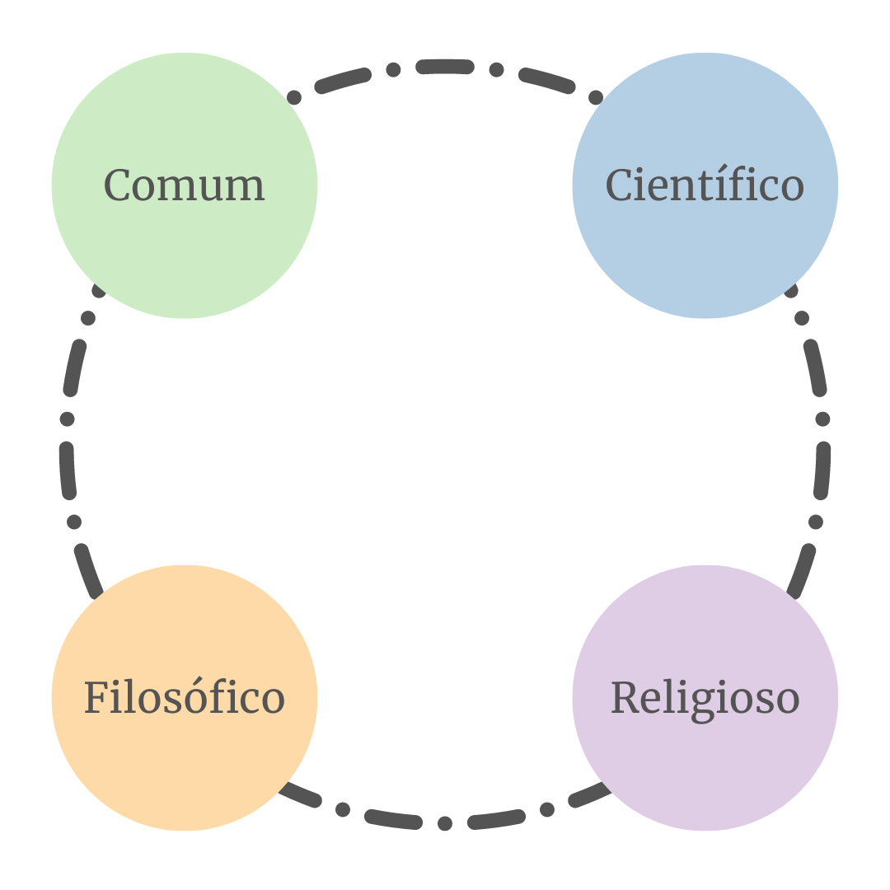

# Conhecimento

## Tipos de conhecimento

|                    | **Comum**                                                              | **Científico**                                                              | **Filosófico**                                                                  | **Teológico**                                                       |
|--------------------|------------------------------------------------------------------------|-----------------------------------------------------------------------------|---------------------------------------------------------------------------------|---------------------------------------------------------------------|
| **O que é**        | Conhecimento gerado a partir de experiências pessoais de um indivíduo. | Conhecimento gerado a partir do método científico, verificável e falseável. | Conhecimento lógico e racional, advindo de reflexões e construção de conceitos. | Maneira de explicar os fenômenos da natureza através de uma crença. |
| **É valorativo?**  | 🗨️                                                                    |                                                                             | 🗨️                                                                             | 🗨️                                                                 |
| **É factual?**     |                                                                        | 🔬                                                                          |                                                                                 |                                                                     |
| **É verificável?** | ✅                                                                      | ✅                                                                           | ➕➖                                                                              |                                                                     |
| **É falível?**     | ☠️                                                                     | ☠️                                                                          | ☠️                                                                              |                                                                     |
| **É exato?**       |                                                                        | ➕➖🎯                                                                        | ➕➖🎯                                                                            | 🎯                                                                  |
| **É sistemático?** |                                                                        | ✅                                                                           | ✅                                                                               | ✅                                                                   |

## Ciência e compreensão da realidade

## Método Científico

## Referências

* [O que é conhecimento?](https://lambrequim.com.br/mas-afinal-o-que-e-conhecimento/)