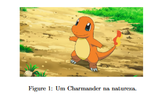

# LaTeX

Esta página descreve brevemente o histórico da linguagem LaTeX, a estrutura básica de um projeto, um tutorial básico 
da linguagem, e recursos adicionais.

## O que é?

## Histórico

## Estrutura de um projeto

## Aprendendo a escrever em LaTeX

A equipe do Overleaf fez um tutorial "Como aprender LaTeX em 30 minutos", disponível 
[neste link](https://www.overleaf.com/learn/latex/Learn_LaTeX_in_30_minutes).

## Exercícios

Crie um novo documento no Overleaf. Para cada uma das linhas da tabela abaixo, faça o que se pede na coluna da esquerda.
Veja como é a saída esperada na coluna da direita.

| Enunciado                  | Exemplo de saída                                                |
|:---------------------------|:----------------------------------------------------------------|
| Figura com legenda embaixo |  |
| Figura com legenda em cima |                                                                 | 
| Tabela com legenda embaixo |                                                                 |
| Tabela com legenda em cima |                                                                 |
| Subfiguras                 |                                                                 | 

## Recursos Adicionais

* [Overleaf](https://www.overleaf.com)
  * [Documentação LaTeX](https://www.overleaf.com/learn)
* [Editor online de equações](https://editor.codecogs.com/)
* 