

# LaTeX

Esta página descreve brevemente o histórico da linguagem LaTeX, a estrutura básica de um projeto, um tutorial básico 
da linguagem, e recursos adicionais.

## O que é?

## Histórico

Donald Knuth

Letras de ferro

Leslie Lamport

## Estrutura de um projeto

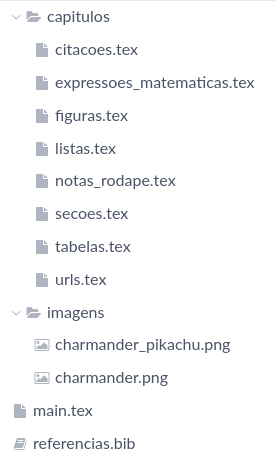

## Aprendendo a escrever em LaTeX

A equipe do Overleaf fez um tutorial "Como aprender LaTeX em 30 minutos", disponível 
[neste link](https://www.overleaf.com/learn/latex/Learn_LaTeX_in_30_minutes).

## Exercícios

> [!NOTE]
> Você precisará usar os comandos `\usepackage` e/ou `\RequirePackage` para fazer alguns destes exercícios, pois nem 
> todos os recursos listados abaixo estão presentes por padrão no LaTeX.
> Consulte na Internet quais destes recursos precisam de importação de pacotes, e qual o nome dos pacotes a serem 
> importados.

Crie um novo documento no Overleaf. Para cada uma das linhas da tabela abaixo, faça o que se pede na coluna da esquerda.
Veja como é a saída esperada na coluna da direita.

| Enunciado                              | Exemplo de saída                                                           |
|:---------------------------------------|:---------------------------------------------------------------------------|
| Texto em itálico, negrito e sublinhado |                                                                            |
| Figura com legenda embaixo             | 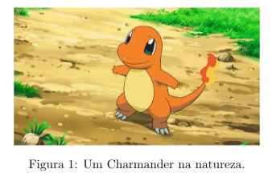                          |
| Figura com legenda em cima             |                            | 
| Subfiguras                             | 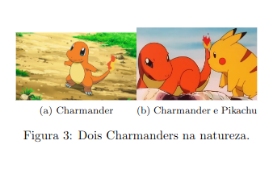                                          |
| Tabela com legenda em cima             | 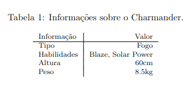                               |
| Tabela com legenda embaixo             |                               |
| Tabela com réguas                      | 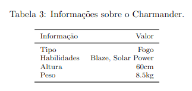                                       |
| Tabela com réguas e cores              | 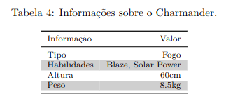                                |
| Tabela com réguas, cores e multilinhas | 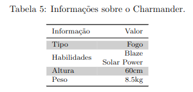                       |
| Lista numerada                         | 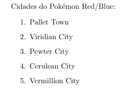                                      |
| Lista não-numerada                     | 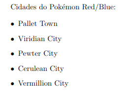                                  |
| Três níveis de seções                  | 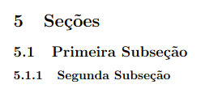                                              |
| Equações                               | 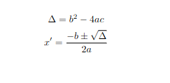                                             |
| Notas de rodapé                        | 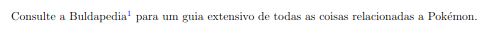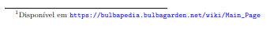 |
| URLs                                   |                                                  |
| Referências                            | 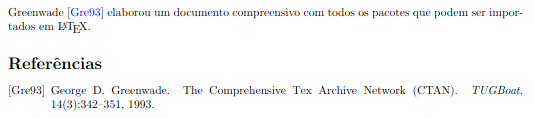                                             |

## Recursos Adicionais

* [Overleaf](https://www.overleaf.com)
  * [Documentação LaTeX](https://www.overleaf.com/learn)
* [Editor online de equações](https://editor.codecogs.com/)
* [História do LaTeX](https://www.youtube.com/watch?v=9eLjt5Lrocw)