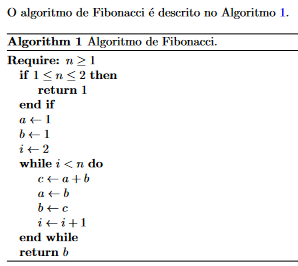

[](https://liascript.github.io/course/?https://raw.githubusercontent.com/CTISM-Prof-Henry/research/main/capitulos/LATEX.md)

# LaTeX

Esta página descreve brevemente o histórico da linguagem LaTeX, a estrutura básica de um projeto, um tutorial básico 
da linguagem, e recursos adicionais.

## O que é?

LaTeX (pronunciado "latéc") é uma linguagem de marcação (não confundir com linguagem de programação!) usada para 
escrever textos técnicos e acadêmicos com alta qualidade gráfica. Ao contrário do Microsoft Word e Libreoffice Write, 
LaTeX **não é** um editor de texto, e sim uma linguagem. Podemos usar diversos editores em conjunto com o LaTeX, como o 
[MikTeX](https://miktex.org/) (um programa que deve ser baixado e instalado no computador), mas o mais popular 
atualmente é o [Overleaf](https://overleaf.com), um editor online. 

A principal diferença do LaTeX em relação ao Microsoft Word está na filosofia: enquanto o Word é do tipo "what you see 
is what you get", LaTeX é do tipo "what you see is what you mean". Em outras palavras: enquanto no Word configuramos a 
aparência do texto, no LaTeX **programamos** a aparência do texto com comandos do tipo `\textit{texto em itálico}`. 

## Por que usar LaTeX?

Diretamente da Seção [Why learn LaTeX](https://www.overleaf.com/learn/latex/Learn_LaTeX_in_30_minutes#Why_learn_LaTeX?) 
da documentação do Overleaf:

* Suporte para escrever expressões matemáticas complexas, tabelas, algoritmos, dentre outros recursos necessários 
  geralmente às ciências "duras";
* Facilidade de escrever notas de rodapé, referências cruzadas (e.g. Seção 1, Figura 1), e gestão de bibliografia;
* Facilidade de produzir elementos textuais chatos ou complicados, como índices, glossários, sumários, listas de 
  figuras, dentre outros;
* Ser altamente customizável através da combinação de pacotes e bibliotecas de terceiros.

## Histórico


Donald Knuth


Letras de ferro


Leslie Lamport

## Aprendendo a escrever em LaTeX

A equipe do Overleaf fez um tutorial "Como aprender LaTeX em 30 minutos", disponível 
[neste link](https://www.overleaf.com/learn/latex/Learn_LaTeX_in_30_minutes).

## Estrutura de um projeto

Você pode organizar seu projeto da maneira que quiser. Mas uma boa organização otimiza o fluxo de trabalho, e dá menos
dores de cabeça no futuro. A estrutura que eu particularmente uso, no geral, é esta:

```
* 📂 capítulos
  * 📄 introdução.tex
  * 📄 trabalhos_relacionados.tex
  * 📄 metodologia.tex
  * 📄 resultados.tex
  * 📄 conclusão.tex 
* 📂 imagens
  * 🖼️ laboratório.jpg
  * 🖼️ diagrama.pdf
* 📄 main.tex   
* 📒 referencias.bib
```

### Tipos de arquivo 

* `.tex` Arquivo com a linguagem de marcação LaTeX. É onde escrevemos o texto propriamente, inserimos figuras, tabelas, 
  citações, etc
* `.bib` é um arquivo onde colocamos todas as citações bibliográficas do documento, para depois serem citadas nos 
  arquivos `.tex` 

> [!NOTE]
> Existem outros dois tipos de arquivo, `.sty` e `.bst`, que configuram respectivamente o estilo de um documento e o 
> formato de citações.

## Dicas

**🖥️ Copie o BibTeX do Google Scholar:** O Google Scholar possui, para a maioria dos artigos e livros, a citação BibTeX 
pronta (e correta). Jogue o nome do documento no buscador e clique no botão  
Depois, selecione a opção **BibTeX**, e copie-e-cole o código no arquivo `.bib` do seu projeto. 

**🟧 Use o StackOverflow sem medo:** muitas vezes eu nem tento fazer as coisas. Eu só procuro no google 
"latex how to use multirow" [e copio a resposta](https://tex.stackexchange.com/questions/73283/how-to-use-multirow). 

## Exercícios

> [!NOTE]
> Você precisará usar os comandos `\usepackage` e/ou `\RequirePackage` para fazer alguns destes exercícios, pois nem 
> todos os recursos listados abaixo estão presentes por padrão no LaTeX.
> Consulte na Internet quais destes recursos precisam de importação de pacotes, e qual o nome dos pacotes a serem 
> importados.

Crie um novo documento no Overleaf. Para cada uma das linhas da tabela abaixo, faça o que se pede na coluna da esquerda.
Veja como é a saída esperada na coluna da direita.

| Enunciado                              | Exemplo de saída                                                           |
|:---------------------------------------|:---------------------------------------------------------------------------|
| Figura com legenda embaixo             |                           |
| Figura com legenda em cima             |                            | 
| Subfiguras                             |                                           |
| Tabela com legenda em cima             |                                |
| Tabela com legenda embaixo             |                               |
| Tabela com réguas                      |                                        |
| Tabela com réguas e cores              |                                 |
| Tabela com réguas, cores e multilinhas |                        |
| Lista numerada                         |                                       |
| Lista não-numerada                     |                                   |
| Três níveis de seções                  |                                               |
| Equações                               |                                              |
| Notas de rodapé                        |  |
| URLs                                   |                                                  |
| Referências                            |                                              |
| Algoritmos                             |                                            |


## Recursos Adicionais

* [Overleaf](https://www.overleaf.com)
  * [Documentação LaTeX](https://www.overleaf.com/learn)
* [Editor online de equações](https://editor.codecogs.com/)
* [História do LaTeX](https://www.youtube.com/watch?v=9eLjt5Lrocw)
* [Tame the BeaST: The B to X of BibTeX](https://linorg.usp.br/CTAN/info/bibtex/tamethebeast/ttb_en.pdf)