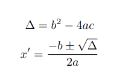

# LaTeX

Esta página descreve brevemente o histórico da linguagem LaTeX, a estrutura básica de um projeto, um tutorial básico 
da linguagem, e recursos adicionais.

## O que é?

## Histórico

Donald Knuth

Letras de ferro

Leslie Lamport

## Estrutura de um projeto

## Aprendendo a escrever em LaTeX

A equipe do Overleaf fez um tutorial "Como aprender LaTeX em 30 minutos", disponível 
[neste link](https://www.overleaf.com/learn/latex/Learn_LaTeX_in_30_minutes).

## Exercícios

> [!NOTE]
> Para fazer alguns destes exercícios, talvez você precise usar os comandos `\usepackage` e `\RequirePackage`.

Crie um novo documento no Overleaf. Para cada uma das linhas da tabela abaixo, faça o que se pede na coluna da esquerda.
Veja como é a saída esperada na coluna da direita.

| Enunciado                              | Exemplo de saída                                                          |
|:---------------------------------------|:--------------------------------------------------------------------------|
| Figura com legenda embaixo             |     |
| Figura com legenda em cima             |      | 
| Subfiguras                             |                     |
| Tabela com legenda embaixo             |         |
| Tabela com legenda em cima             |          |
| Tabela com réguas                      |                  |
| Tabela com réguas e cores              |           |
| Tabela com réguas, cores e multilinhas |  |
| Lista numerada                         |                 |
| Lista não-numerada                     |             |
| Três níveis de seções                  |                         |
| Equações                               |                        |

## Recursos Adicionais

* [Overleaf](https://www.overleaf.com)
  * [Documentação LaTeX](https://www.overleaf.com/learn)
* [Editor online de equações](https://editor.codecogs.com/)
* [História do LaTeX](https://www.youtube.com/watch?v=9eLjt5Lrocw)