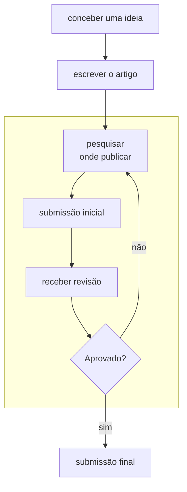
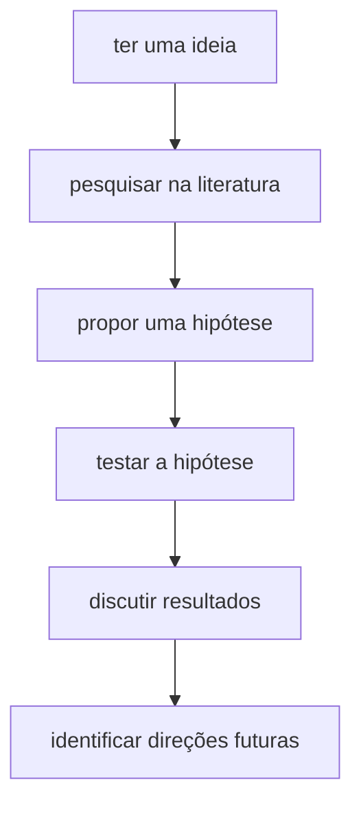

# Publicando sua pesquisa

Pesquisar e publicar geralmente possuem um fluxo de trabalho bem definido:

## Concepção

## Submissão

1. Identificar revistas ou conferências para a submissão
2. Ver o guia para autores

## Escrita

Siga para o capítulo [Artigos](ARTIGOS.md).

## Submissão 

### Inicial

### Resultado

#### Aprovado

#### Reprovado

### Final

## Recursos Adicionais

* [Guia da Elsevier para publicar artigos](https://www.elsevier.com/researcher/author/submit-your-paper) 