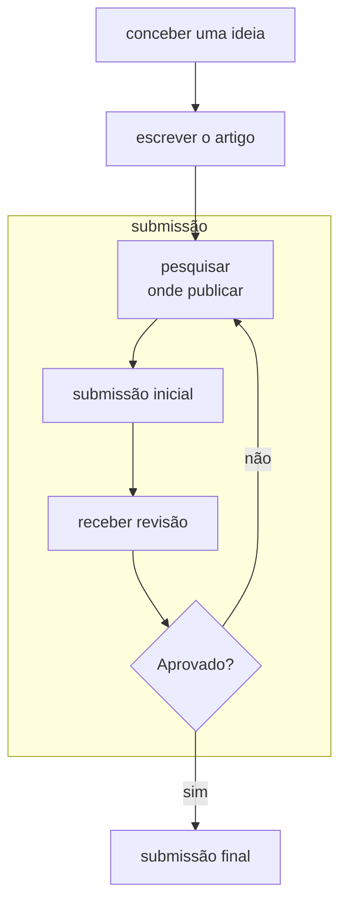
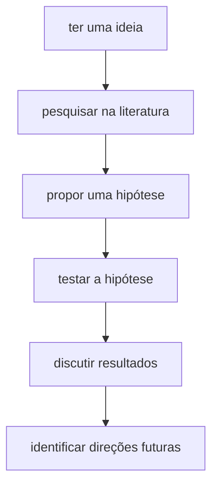
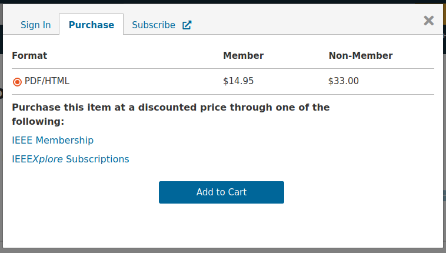
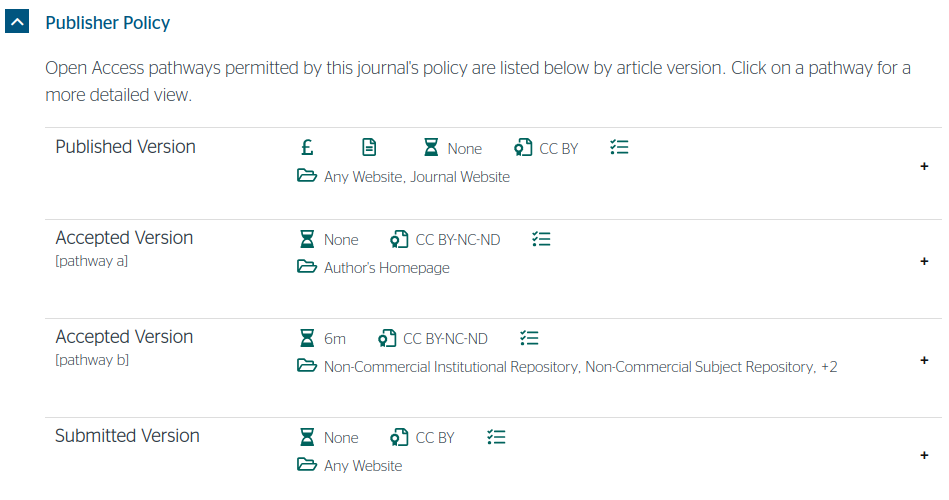

# Publicando sua pesquisa

Pesquisar e publicar geralmente possuem um fluxo de trabalho bem definido:

## 1. Concepção

O fluxograma de conceber uma ideia pode ser descrito da seguinte forma:

## 2. Escrita

O capítulo [Artigos](ARTIGOS.md) entra em maiores detalhes sobre como escrever artigos.

## 3. Submissão

O processo de submissão envolve diversas etapas menores. 

### 3.1 Pesquisar onde submeter

Quando um artigo está pronto, não basta simplesmente submetê-lo para qualquer lugar: é preciso achar um local onde a 
probabilidade dele ser aceito é alta. Também existem outros aspectos, como o custo de submissão, e o controle de acesso 
do artigo uma vez publicado.

**🎯 Identifique o público-alvo:** São engenheiros? Cientistas da Computação? Pedagogos? Artistas? Se você mandar um 
artigo de engenharia para uma revista de pedagogia, as chances de aceitação serão baixas!

**📢 Pesquise o fator de impacto:** Não queime seu artigo em uma revista ou conferência que não o merece! Busque 
encontrar um veículo de publicação que tenha alto fator de impacto, mas que seja compatível com a qualidade do seu 
artigo. Você pode consultar o conceito Qualis de revistas na 
[página da CAPES](https://sucupira.capes.gov.br/sucupira/public/consultas/coleta/veiculoPublicacaoQualis/listaConsultaGeralPeriodicos.jsf),
e o conceito Qualis de conferências na área de computação na [página do Programa de Pós-Graduação em Ciência da 
Computação da PUCRS](https://ppgcc.github.io/discentesPPGCC/pt-BR/qualis/). O Google Scholar também mantém um 
[índice](https://scholar.google.com/citations?view_op=metrics_intro&hl=pt-BR) dos melhores lugares para publicar seu 
artigo com base no índice-h.

**💲 Veja se é preciso pagar:** Algumas revistas exigem que seja paga uma taxa para publicação de artigos (geralmente 
cobrada na casa de milhares de dólares). Para conferências, é comum que pelo menos um autor esteja registrado no evento 
e vá apresentar o artigo (seja lá onde a conferência for!) É bom ver isto antes de começar um processo de submissão! O 
site [Sherpa Romeo](https://www.sherpa.ac.uk/romeo/) possui uma base extensiva de veículos de publicação e quanto custa
para publicar em cada lugar.

**🔐 Veja como ficará o acesso após a publicação:** Cuidado para não sair compartilhando a versão errada! A versão que é 
publicada em um repositório online geralmente só é acessível através do pagamento de uma taxa de acesso única:

Ou então através da assinatura de um serviço de acesso a repositórios online de artigos (geralmente paga por 
universidades). Porém, a versão submetida para revisão geralmente não possui essas restrições, podendo ser compartilhada 
com colegas, e no site da universidade:

(imagem adaptada [deste link](https://v2.sherpa.ac.uk/id/publication/2234))

Uma dica importante para seu trabalho ser lido e lembrado é publicar a versão permitida pela revista no repositório 
online da sua universidade. A UFSM por exemplo possui o [Manancial](https://repositorio.ufsm.br/), que publica artigos 
através de solicitações por e-mail. Você também pode colocar seu artigo no [Research Gate](https://www.researchgate.net/), 
uma rede social para compartilhamento de artigos.

**🔁 Compartilhe nas redes sociais:** Você sabia que artigos que possuem posts em redes sociais são mais lidos?[^1] 
Talvez isto não aumente o número de citações (como demonstrado no artigo[^2]), mas é melhor divulgar o seu trabalho do 
que deixá-lo engavetado uma vez publicado!

[^1]: Disponível [neste link](https://www.science.org/content/article/scienceadviser-sharing-papers-social-media-probably-doesn-t-increase-citations-and-s)
[^2]: Disponível [neste link](https://www.biorxiv.org/content/10.1101/2023.09.17.558161v1.full?et_rid=960447322&et_cid=4918971)

**🤖 Use um serviço de busca automatizado:** você pode usar sites como [Elsevier Journal Finder](https://journalfinder.elsevier.com),
[Researcher Life](https://researcher.life/journal), [Wiley Journal Finder](https://journalfinder.wiley.com/search?type=match)
etc para colar o resumo do seu artigo e ver qual revista desta editora é mais adequada para seu artigo!

**🪤 Cuidado com as revistas predatórias:** Recebeu um e-mail dizendo que seu TCC é muito bom e renderia um capítulo de livro, mas
precisa pagar 200 reais? É furada! Pesquise o nome da publicação na internet e veja se não é uma revista predatória (sem fator de impacto
nenhum, e que cobra para fazer submissões). Estas revistas mandam inúmeros e-mails como o que você recebeu por mês, e este é o 
modelo de negócio delas!

### 3.2 Enviar versão inicial

Quando você localizar uma revista ou uma conferência para enviar seu artigo, leia atentamente o Guia para Autores 
([exemplo](https://www.sciencedirect.com/journal/ecological-informatics/publish/guide-for-authors)) para saber quais 
requisitos seu artigo deve atender antes de ser considerado para publicação. As vezes,
falhar em algum destes critérios é suficiente para o artigo sequer ser revisado!

### 3.3 Receber resultado

> [!NOTE]
> O revisor 2 quase sempre é um babaca.

Por vezes, quando submetemos nosso artigo para revisão, o processo de revisão segue uma das duas seguintes opções:

* **blind:** os autores não sabem quem são os revisores, mas os revisores sabem quem são os autores.
* **double blind:** nem os revisores nem os autores sabem quem são uns aos outros.

Este processo é feito de maneira a evitar que as pessoas sejam levadas a aprovar artigos de pesquisadores renomados, 
simplesmente porque são famosos no meio científico. Porém, o outro efeito é que os textos de revisão podem vir com 
expressões ríspidas.

Não se deixe desanimar com isso! Implemente as modificações sugeridas, se julgar pertinente. Se o artigo for aceito, 
faça as alterações para a versão final; se o artigo não foi aceito, pondere se implementando as sugestões dos revisores,
as chances de enviar para outro veículo de publicação serão maiores no futuro.

Uma rejeição de um artigo geralmente significa que o artigo não pode ser resubmetido para aquele mesmo veículo. Portanto,
neste caso, é hora de achar outro local para publicar!

### 3.4 Enviar versão final

Algumas revistas exigem que uma carta de resposta aos revisores seja elaborada após as correções implementadas. Nesta 
carta, é preciso fazer um _changelog_ de tudo que foi feito desde a versão anterior, e justificar o porque das 
modificações feitas (por exemplo, se você não acatou uma sugestão, vai precisar defendê-la em termos científicos). 

Após enviar a nova versão do artigo e esta carta, não é garantia que o artigo será publicado: pode ser que uma nova 
rodada de revisões ocorra, e até mesmo que seu artigo seja rejeitado nesta nova revisão! 
(curiosidade: já aconteceu comigo...)

Não deixe que isso lhe desanime! Tudo isto faz parte do processo.

## 4. Recursos Adicionais

* [Guia da Elsevier para publicar artigos](https://www.elsevier.com/researcher/author/submit-your-paper) 
