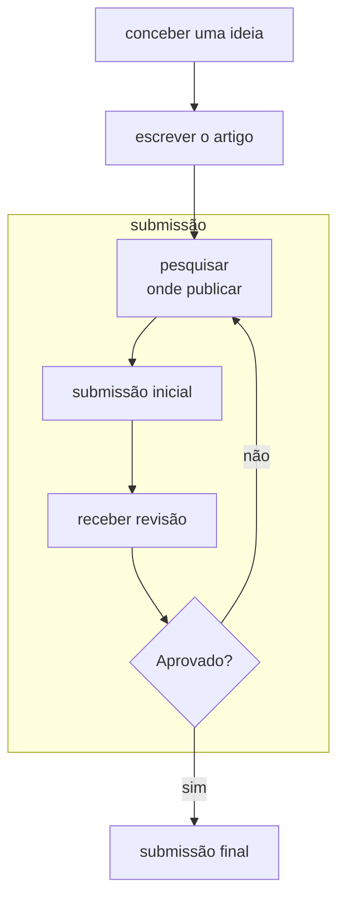
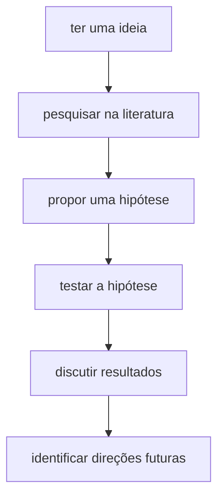
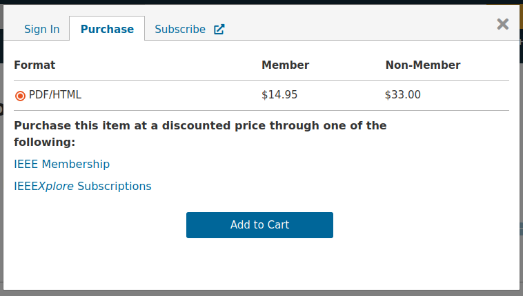
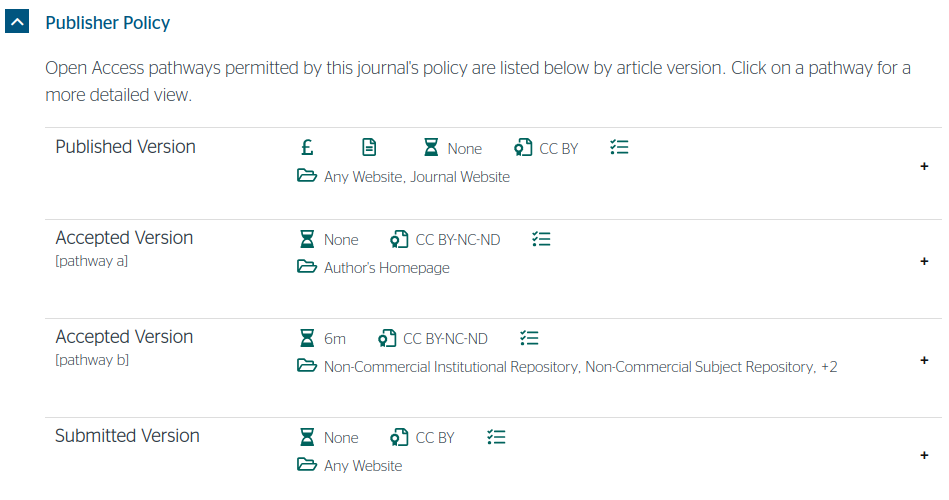

# Publicando sua pesquisa

Pesquisar e publicar geralmente possuem um fluxo de trabalho bem definido:

## Concepção

O fluxograma de conceber uma ideia pode ser descrito da seguinte forma:

## Escrita

Siga para o capítulo [Artigos](ARTIGOS.md).

## Submissão

O processo de submissão envolve diversas etapas menores. 

### Pesquisar onde submeter

Quando um artigo está pronto, não basta simplesmente submetê-lo para qualquer lugar: é preciso achar um local onde a 
probabilidade dele ser aceito é alta. Também existem outros aspectos, como o custo de submissão, e o controle de acesso 
do artigo uma vez publicado.

**🎯 Identifique o público-alvo:** São engenheiros? Cientistas da Computação? Pedagogos? Artistas? Se você mandar um artigo
de engenharia para uma revista de pedagogia, as chances de aceitação serão baixas!

**💲 Veja se é preciso pagar:** Algumas revistas exigem que seja paga uma taxa para publicação de artigos (geralmente 
cobrada na casa de milhares de dólares). Para conferências, é comum que pelo menos um autor esteja registrado no evento 
e vá apresentar o artigo (seja lá onde a conferência for!) É bom ver isto antes de começar um processo de submissão! O 
site [Sherpa Romeo](https://www.sherpa.ac.uk/romeo/) possui uma base extensiva de veículos de publicação e quanto custa
para publicar em cada lugar.

**🔐 Veja como ficará o acesso após a publicação:** Cuidado para não sair compartilhando a versão errada! A versão que é 
publicada em um repositório online geralmente só é acessível através do pagamento de uma taxa de acesso única:

Ou então através da assinatura de um serviço de acesso a repositórios online de artigos (geralmente paga por 
universidades). Porém, a versão submetida para revisão geralmente não possui essas restrições, podendo ser compartilhada 
com colegas, e no site da universidade:

(imagem adaptada [deste link](https://v2.sherpa.ac.uk/id/publication/2234))

Uma dica importante para seu trabalho ser lido e lembrado é publicar a versão permitida pela revista no repositório 
online da sua universidade. A UFSM por exemplo possui o [Manancial](https://repositorio.ufsm.br/), que publica artigos 
através de solicitações por e-mail. 

**🔁 Compartilhe nas redes sociais:** Você sabia que artigos que possuem posts em redes sociais são mais lidos?[^1] 
Talvez isto não aumente o número de citações (como demonstrado no artigo[^2]), mas é melhor divulgar o seu trabalho do 
que deixá-lo engavetado uma vez publicado!

[^1]: Disponível [neste link](https://www.science.org/content/article/scienceadviser-sharing-papers-social-media-probably-doesn-t-increase-citations-and-s)
[^2]: Disponível [neste link](https://www.biorxiv.org/content/10.1101/2023.09.17.558161v1.full?et_rid=960447322&et_cid=4918971)

### Enviar versão inicial

### Receber resultado

> [!NOTE]
> O revisor 2 quase sempre é um babaca.

### Enviar versão final

## Recursos Adicionais

* [Guia da Elsevier para publicar artigos](https://www.elsevier.com/researcher/author/submit-your-paper) 