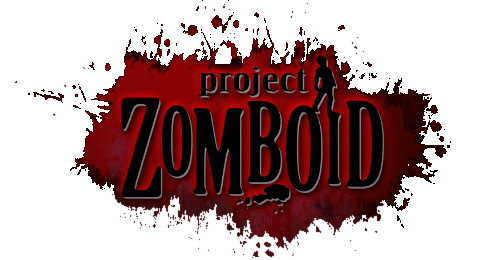

# Tipos de Trabalhos Acadêmicos

|                                                                   | Documento       | Descrição                                                                                                                     |
|:-----------------------------------------------------------------:|:----------------|:------------------------------------------------------------------------------------------------------------------------------|
|   | **Fichamento**  | Registro resumido de um texto ou obra, destacando suas principais ideias e informações relevantes.                            |
|      | **Sinopse**     | Breve resumo que apresenta a essência de um conteúdo, geralmente usado em obras literárias, filmes ou peças teatrais.         |
|      | **Resenha**     | Análise crítica de uma obra, como livros, filmes ou artigos, com comentários sobre seu conteúdo, estilo e relevância.         |
|    | **Relatório**   | Documento que apresenta dados e informações sobre um determinado assunto, resultado de pesquisas ou atividades.               |
|      | **Projeto**     | Documento que descreve um plano detalhado para a realização de uma atividade, incluindo objetivos, metodologias e cronograma. |
|     | **Memorial**    | Narrativa autobiográfica ou de eventos históricos, geralmente destacando experiências e realizações significativas.           |
|       | **Resumo**      | Síntese das principais informações de um texto, destacando os pontos mais importantes de forma concisa.                       |
|       | **Pôster**      | Apresentação visual de informações sobre um tema, frequentemente usada em conferências e eventos acadêmicos.                  |
|        | **Artigo**      | Trabalho acadêmico ou científico que aborda um tema específico, geralmente publicado em revistas ou periódicos.               |
|   | **Monografia**  | Estudo aprofundado sobre um tema específico, geralmente apresentado como requisito para a conclusão de um curso de graduação. |
|  | **Dissertação** | Trabalho acadêmico que apresenta uma pesquisa original, geralmente exigido para a obtenção do grau de mestre.                 |
|         | **Tese**        | Trabalho acadêmico que apresenta uma pesquisa original e aprofundada, geralmente exigido para a obtenção do grau de doutor.   |

## Referências

* [11 tipos de trabalhos acadêmicos que todo estudante deve conhecer](https://doity.com.br/blog/trabalhos-academicos/)
* [Criar novo Tier List](https://tiermaker.com/create/new/)
* [PhD Comics](https://phdcomics.com)